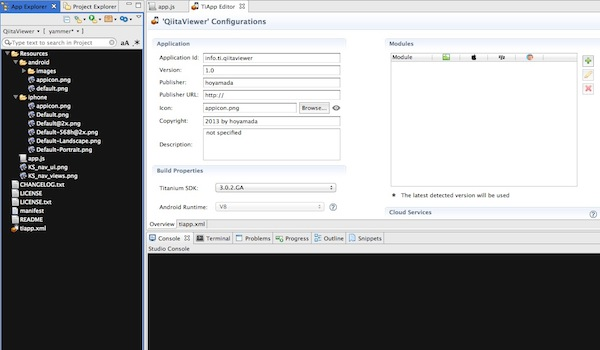

# Webサービスと連携したアプリ作成講座

## 本講座の位置づけについて

この講座では、実際のWebサービスと連携するアプリの制作を通じて、端末の通信機能を利用したアプリを作成する方法を学びます。

本講座では[Qiita](http://qiita.com/)というサービスのビューワを制作し、通信機能の作り方を学びます。なお、受講にあたっては、[Qiita](http://qiita.com/)のアカウントは必要ありません。

## 講座概要

- 本講座用にプロジェクトを設定する
- 端末の通信機能を使ってQiitaの情報を取得する
	- Titanium Mobileの通信機能についての解説
		- Titanium Mobileの 通信機能のhttpClientについて
	- Qiitaの投稿情報を取得するWebAPIの解説
		- QiitaのWebAPIの構造について
		- 実装する前にWebブラウザを使ってQiitaのWebAPIにアクセスする		
	- Qiitaの投稿情報を取得する処理を実装する
		- Titanium Mobileの 通信機能を使って実装する
- Qiitaから取得した結果を画面に配置する
	- スマートフォン向けアプリでよくある一覧機能表示する機能についての解説
		- Titanium MobileのTableViewについて
		- 活用事例の紹介
	- サンプルデータを使ってTableViewの使い方について学ぶ
	- 取得したQiitaの投稿情報をTableViewを使って画面表示する
		- 取得した投稿情報のタイトルだけ表示する
		- 取得した投稿情報のタイトルとアイコン画像を表示する
- 参考資料

## 本講座用にプロジェクトを設定する


Titanium Studioを起動して、QiitaViewer用にプロジェクトを作成するためにFile → New → Mobile Project と進みます


Projectのテンプレートを選択する画面が標示されたら、「Default Project」を選択して次に進みます


Projectの詳細情報を入力する画面が標示されるので以下のように入力/選択して、finishボタンをクリックします

- プロジェクト名: **QiitaViewer**
- AppID: **info.ti.qiitaviewer**
- ターゲットOS:iPhone、Androidのみチェック。iPad、MobileWebはオフにする


しばらくすると、以下の様な画面が標示されて、Projectの初期設定が完了します



念のためこの状態でbuildが出来るかどうか確認するため、Titanium StudioのApp Explorerのrunのアイコンを選択します


<table>
<th>iPhone起動時の画面キャプチャ</th>
<th>Android起動時の画面キャプチャ</th>
<tr>
<td>
<a href="image/qiitaviewer-project-006.jpg" target="_blank"></a>
</td>
<td>
<a href="image/qiitaviewer-project-007.jpg" target="_blank"></a>
</td>
</tr>
</table>


## 端末の通信機能を使ってQiitaの情報を取得する

QiitaのようなWebAPIと連携するアプリを開発する場合に、Titanium Mobile通信機能を使うことで比較的簡単に実現することができます。
この章では

- Titanium Mobileの通信機能についての解説
- Qiitaの投稿情報を取得するWebAPIの解説
- Qiitaの投稿情報を取得する処理を実装する

という３つのステップに分けて順番に解説していきます

### Titanium Mobileの通信機能についての解説

標準機能のhttpCLientを活用することで簡単に実現できますが、まずはhttpCLientの使い方について解説をします。

QiitaのようなWebAPIを提供するWebサービスは多数あるかと思います。そういったWebAPIにアクセスしてXML形式のファイルやJSON形式のテキストファイルを取得する際にTitanium Mobileの標準機能のhttpCLientを活用します。

なお、インターネット上のHTMLコンテンツを取得すること自体はもちろん可能です。ただし、「すべてのimgタグの要素を抜き出す」というようなHTMLの構造を解析した上で、何か処理をしたい場合には、そもそもTitanium MobileのhttpCLientにはそのような機能がありません。

もしもそのような処理をしたい場合には
- US Yahooが提供してる YQLというサービスを使える仕組みがTitanium Mobile 標準にあるのでそれを活用する
- Titanium MobileのhttpCLientでHTMLファイルを取得した後、外部のライブラリなどを活用してHTMLの構文解析をする


### Qiitaの投稿情報を取得するWebAPIの解説

Titanium Mobileで実装をはじめる前に、Qiitaの投稿情報を取得する時のWebAPIについて簡単に説明します

#### QiitaのWebAPIの構造について


#### 実装する前にWebブラウザを使ってQiitaのWebAPIにアクセスする		

実装する前にWebブラウザを使ってQiitaのWebAPIにアクセスして、どのような結果が取得できるのかを確認してみましょう。

Webブラウザを起動して以下URLにアクセスします

[https://qiita.com/api/v1/items](https://qiita.com/api/v1/items)

以下はMac版のGoogle Chromeでアクセスした時の画面イメージになります。


投稿情報は以下の様なJSON形式になりますが、詳しい情報を知りたい方は、[Qiitaのサイトをご覧ください](http://qiita.com/docs#13)

```javascript
[{"id": 1,
 "uuid": "1a43e55e7209c8f3c565",
 "user":
  {"name": "Hiroshige Umino",
   "url_name": "yaotti",
   "profile_image_url": "https://si0.twimg.com/profile_images/2309761038/1ijg13pfs0dg84sk2y0h_normal" },
 "title": "てすと",
 "body": "<p>foooooooooooooooo</p>\n",
 "created_at": "2012-10-03 22:12:36 +0900",
 "updated_at": "2012-10-03 22:12:36 +0900",
 "created_at_in_words": "18 hours ago",
 "updated_at_in_words": "18 hours ago",
 "tags":
  [{"name": "FOOBAR",
    "url_name": "FOOBAR",
    "icon_url": "http://qiita.com/icons/thumb/missing.png",
    "versions": ['1.2', '1.3']}],
 "stock_count": 0,
 "stock_users": [],
 "comment_count": 0,
 "url": "http://qiita.com/items/1a43e55e7209c8f3c565",
 "gist_url": null,
 "tweet": false,
 "private": false,
 "stocked": false
},
 ...
]
```

### Qiitaの投稿情報を取得する処理を実装する

QiitaのWebAPIの構造についておおまかに理解した上で実際にQiitaの投稿情報を取得する処理を実装していきます。

#### Titanium Mobileの 通信機能を使って実装する

Titanium MobileのhttpClientについて解説します

```javascript
var xhr,qiitaURL,method;
qiitaURL = "https://qiita.com/api/v1/items";
method = "GET";
xhr = Ti.Network.createHTTPClient(); // (1)
xhr.open(method,qiitaURL);  // (2)
xhr.onload = function(){
  var body;
  if (this.status === 200) { // (3)
    body = JSON.parse(this.responseText); // (4)
	Ti.API.info(body);
  } else {
    Ti.API.info("error:status code is " + this.status);
  }
}
xhr.onerror = function(e) { // (5)
  var error;
  error = JSON.parse(this.responseText);
  Ti.API.info(error.error);
}
xhr.timeout = 5000;
xhr.send();
```

1. httpClientを利用するためのオブジェクトを生成します

2. open()メソッドを使ってQiitaのWebAPIにアクセスします。最初の引数にHTTPメソッドを指定しますが、Qiitaの投稿の取得をする場合には、GETメソッドを指定する必要があります（詳しくは[Qiitaのドキュメント](http://qiita.com/docs#13)を参照してください)次の引数で投稿情報を取得するQiitaのエンドポイントとなるURLを指定します。

3. QiitaのWebAPIにアクセスして、接続成功したかどうかを判定して、その後の処理を実施します。具体的にはthis.statusの値を確認して、値が200の場合には接続成功しているため該当する処理を実施します

4. this.responseTextの値を確認することで、サーバから取得できた値をテキスト形式で取得できます。this.responseTextは見た目はJSON形式になっていますが、そのまま変数に代入すると文字列としてその後処理されてしまうため、JSON.parse()を使って、JSON化した状態で変数に格納します

5. 例えば、QiitaのWebAPIにアクセスして、150リクエスト/1時間というAPIの利用制限に引っかかってしまう場合などはエラーになり、その時にはonerrorイベントが呼び出されます。

イメージとしては以下のような対応関係になります


動作確認するために、buildした結果は以下のとおりです

<table>
<th>iPhone起動時の画面キャプチャ</th>
<th>Android起動時の画面キャプチャ</th>
<tr>
<td>
<a href="image/qiitaviewer-httpClient-iphone-001.jpg" target="_blank"></a>
</td>
<td>
<a href="image/qiitaviewer-httpClient-android-001.jpg" target="_blank"></a>
</td>
</tr>
</table>

シミュレーターの画面には何も標示されずコンソール上に複数の文字が標示されるかと思いますので、その点が確認できたらOKです。

この段階ではTitanium Mobileの通信機能を使ってデータ取得することを目的に実装しているため、スマートフォンの画面表示するところまでは実装していません。

次の章で、Qiitaから取得した結果を画面に配置する処理について解説していきます

## Qiitaから取得した結果を画面に配置する

Titanium Mobileの通信機能を使ってQiitaの投稿情報を取得できるようになったかと思います。

取得した結果をスマートフォン上で見やすく配置する方法について順番に解説していきます

### スマートフォン向けアプリでよくある一覧機能表示する機能についての解説


#### Titanium MobileのTableViewについて

iOS向けの特にニュースリーダー系のアプリケーションに採用されているユーザインタフェースとして、垂直方向にスクロールしながら情報を表示するようなものがあるかと思いますが、そういったユーザインタフェースを実現するための要素としてTableViewというものがあります。

#### 活用事例の紹介

ニュースリーダー系のアプリケーションと言っても、イメージがつかない場合もあるかと思いますので、TableViewの活用事例について紹介します。


### サンプルデータを使ってTableViewの使い方について学ぶ


### 取得したQiitaの投稿情報をTableViewを使って画面表示する

Titanium Mobileの標準APIであるhttpCLientを活用して、Qiitaの投稿情報を取得する処理までは実装出来ましたので、今度は取得した情報を画面に表示する部分について解説します

#### 取得した投稿情報のタイトルだけ表示する

Qiitaの開発者向けのAPIを通じて投稿情報を取得した結果をTableViewを活用して表示する方法について解説します。

図にすると以下の様な処理になります。


以下のソースコードをサンプルに順次解説していきます。

```javascript
var xhr,qiitaURL,method,mainTable,win;
mainTable = Ti.UI.createTableView({
  width: 320,
  height:480,
  backgroundColor:"#fff",
  left: 0,
  top: 0
});
win = Ti.UI.createWindow({
  title:'QiitaViewer'
});

qiitaURL = "https://qiita.com/api/v1/items";
method = "GET";
xhr = Ti.Network.createHTTPClient();
xhr.open(method,qiitaURL);
xhr.onload = function(){
  var body,_i ,_len ,row ,rows,textLabel;
  if (this.status === 200) {
    body = JSON.parse(this.responseText);
    rows = [];
    for (_i = 0, _len = body.length; _i < _len; _i++) { // (1)
      Ti.API.info(body[_i].title);
      row = Ti.UI.createTableViewRow({	// (2)
        width: 'auto',
        height:40,
        borderWidth: 0,
		className:'entry',
        color:"#222"
      });
      textLabel = Ti.UI.createLabel({	// (3)
        width:'auto',
        height:30,
        top:5,
        left:5,
        color:'#222',
        font:{
          fontSize:16,
          fontWeight:'bold'
        },
        text:body[_i].title
      });
      row.add(textLabel);		// (4)
      rows.push(row);			// (5)
    }
    mainTable.setData(rows);    // (6)
    win.add(mainTable);
    win.open();

  } else {
    Ti.API.info("error:status code is " + this.status);
  }
};
xhr.onerror = function(e) {
  var error;
  error = JSON.parse(this.responseText);
  Ti.API.info(error.error);
};

xhr.send();
```

1. body.lengthの値を確認することでWebAPIから取得した投稿件数が確認できるので、その件数分ループして、投稿情報を１つづつ取り出していきます
2. 投稿情報の要素を格納するためにTableViewRowを生成します
3. 投稿情報のタイトル部分を格納するためにLabelを生成します
4. 上記で生成したLabelをTableViewRowに配置します
5. TableViewRowを配列rowsに挿入します
6. WebAPIから取得した投稿件数分のTableViewRowが配列rowsに格納されているので、その情報をTableViewに表示するために、setDataメソッドを使います

上記をbuildして、iPhone、AndroidのEmulatorで表示した場合以下の様になります

<table>
<th>iPhone起動時の画面キャプチャ</th>
<th>Android起動時の画面キャプチャ</th>
<tr>
<td>
<a href="image/qiitaviewer-httpClient-iphone-002.jpg" target="_blank"></a>
</td>
<td>
<a href="image/qiitaviewer-httpClient-android-002.jpg" target="_blank"></a>
</tr>
</table>


#### 取得した投稿情報のタイトルとアイコン画像を表示する

先程は、タイトルのみ表示する方法について解説しましたが、タイトルだけではなく投稿したユーザのアイコンをTableViewを活用して表示する方法について解説します

図にすると以下の様な処理になります。


TableViewを使って投稿情報のタイトルと投稿したユーザのアイコンを表示するソースコード全体は以下になります

```javascript
var xhr,qiitaURL,method,mainTable,win;
mainTable = Ti.UI.createTableView({
  width: 320,
  height:480,
  backgroundColor:"#fff",
  left: 0,
  top: 0
});
win = Ti.UI.createWindow({
  title:'QiitaViewer'
});

qiitaURL = "https://qiita.com/api/v1/items";
method = "GET";
xhr = Ti.Network.createHTTPClient();
xhr.open(method,qiitaURL);
xhr.onload = function(){
  var body,_i ,_len ,row ,rows,textLabel,iconImage,imagePath;
  if (this.status === 200) {
    body = JSON.parse(this.responseText);
    rows = [];
    for (_i = 0, _len = body.length; _i < _len; _i++) {
      row = Ti.UI.createTableViewRow({
        width: 'auto',
        height:60,
        borderWidth: 0,
		className:'entry',
        color:"#222"
      });
      textLabel = Ti.UI.createLabel({
        width:250,
        height:30,
        top:5,
        left:60,
        color:'#222',
        font:{
          fontSize:16,
          fontWeight:'bold'
        },
        text:body[_i].title
      });
      imagePath = body[_i].user.profile_image_url;
      iconImage = Ti.UI.createImageView({
        width:40,
        height:40,
        top:5,
        left:5,
        defaultImage:"logo.png",
        image: imagePath
      });

      row.add(textLabel);
      row.add(iconImage);
      rows.push(row);
    }
    mainTable.setData(rows);
    win.add(mainTable);
    win.open();

  } else {
    Ti.API.info("error:status code is " + this.status);
  }
};
xhr.onerror = function(e) {
  var error;
  error = JSON.parse(this.responseText);
  Ti.API.info(error.error);
};
xhr.timeout = 5000;
xhr.send();
```

上記ソースコードをbuildして、iPhone、AndroidのEmulatorで表示した場合以下の様になります

<table>
<th>iPhone起動時の画面キャプチャ</th>
<th>Android起動時の画面キャプチャ</th>
<tr>
<td>
<a href="image/qiitaviewer-tableView-iphone-001.jpg" target="_blank"></a>
</td>
<td>
<a href="image/qiitaviewer-tableView-android-001.jpg" target="_blank"></a>
</tr>
</table>


なお、投稿したユーザのアイコンを表示する時に１つ意識しておいたほうが良い部分があります。

今回のようなWebAPIを通じて画像を取得して表示するような場合、ネットワークの回線状況によってはすぐに標示されるとは限りません。

そのため、ImageViewのdefaultImageというプロパティに、あらかじめローカルに準備しておいた画像を指定することで、

1. 最初にローカルの画像が表示
2. 画像のダウンロード完了時に、ローカルの画像とリモートから取得した画像が入れ替わる

という処理が自動的にされるので、以下のようにTitaniumのImageViewのdefaultImageのプロパティを適切に設定することをお勧めします

```javascript
// 一部抜粋
imagePath = body[_i].user.profile_image_url;
iconImage = Ti.UI.createImageView({
  width:40,
  height:40,
  top:5,
  left:5,
  defaultImage:"logo.png",
  image: imagePath
});
row.add(iconImage);
```

## 参考資料
 
### YQL

インターネット上にあるコンテンツをSQLに似た独自言語で取得することが出来るUS Yahooが提供してるWebサービス。


### HTML parser

私は使ったことないですが、Titanium Mobile向けのHTML parserがGitHubのGistにあります。

[詳しくはこちら](https://gist.github.com/zeuxisoo/1016047)

